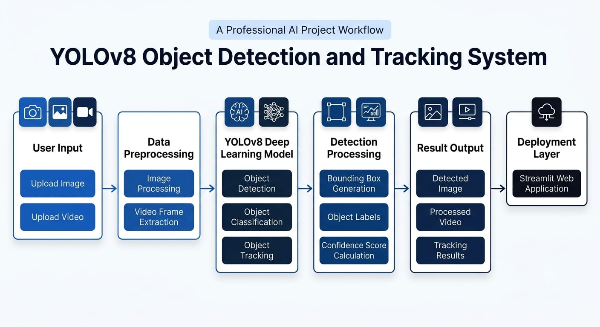
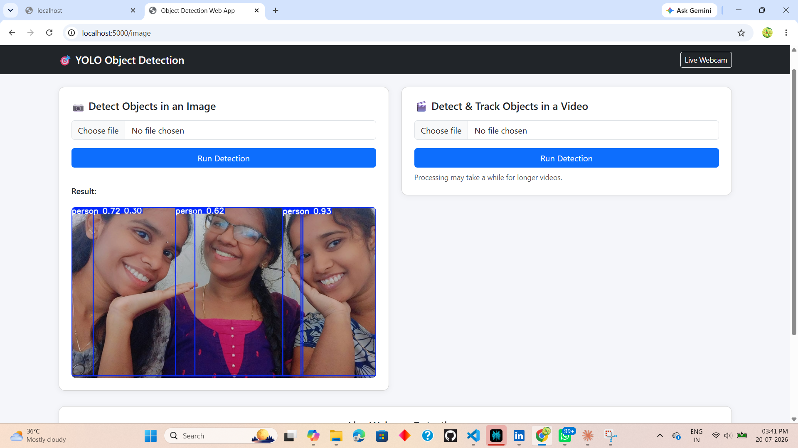

# 🎯 Object Detection & Tracking Web App

A Flask web application for real-time object detection and tracking using **YOLOv8**. Upload an image, upload a video, or use your live webcam — all processed with bounding boxes, class labels, and persistent tracking IDs.

Built as part of the **CodeAlpha Internship — Task 4: Object Detection and Tracking**.

---

## ✨ Features

- 📷 **Image Detection** — upload a JPG/PNG, get back an annotated image with detected objects
- 🎬 **Video Detection & Tracking** — upload an MP4/AVI/MOV, get back a processed video with bounding boxes and consistent tracking IDs across frames
- 📹 **Live Webcam Detection** — real-time detection and tracking streamed directly in the browser
- ⚡ Optimized for CPU inference (frame skipping + reduced inference resolution)
- 🌐 Output videos are automatically re-encoded to browser-compatible H.264 MP4

---

## 🎥 Demo

### Project Workflow



### Sample Output

**Image Detection**


### Demo Video

📺 [Watch the full demo video on Google Drive](https://drive.google.com/file/d/1_vmjuP3uJ6LOxGO15Ge1vbQkmS5-r1iM/view?usp=drivesdk)

> **Note:** make sure the Drive file's sharing setting is **"Anyone with the link"** (Viewer access), otherwise visitors to your GitHub repo won't be able to open it.

<details>
<summary>📌 How to add your own screenshots (click to expand)</summary>

1. Create an `assets/` folder at the repo root (if it doesn't exist)
2. Save your workflow diagram, image output, and video output screenshots as `workflow.png`, `image_output.png`.
3. Commit and push:
   ```bash
   git add assets/
   git commit -m "Add workflow diagram and output screenshots"
   git push
   ```

</details>

---

## 🛠️ Tech Stack

| Component | Purpose |
|---|---|
| [Flask](https://flask.palletsprojects.com/) | Web server & routing |
| [Ultralytics YOLOv8](https://docs.ultralytics.com/) | Object detection + built-in ByteTrack tracking |
| [OpenCV](https://opencv.org/) | Video I/O, frame processing, webcam capture |
| [imageio-ffmpeg](https://github.com/imageio/imageio-ffmpeg) | Re-encodes output video to browser-playable H.264 |
| [Bootstrap 5](https://getbootstrap.com/) | Frontend styling (via CDN) |

---

## 📁 Project Structure

```
object_detection_tracking_YOLO/
├── app.py                    # Flask app — routes, detection & tracking logic
├── requirements.txt           # Python dependencies
├── yolov8n.pt                  # YOLOv8 model weights (auto-downloads on first run)
├── templates/
│   ├── index.html                # Home page — image & video upload
│   └── webcam.html               # Live webcam detection page
├── static/
│   ├── uploads/                   # Uploaded files (auto-created)
│   └── results/                    # Processed output files (auto-created)
└── assets/                       # README media — workflow diagram & output screenshots
    ├── workflow.png
    ├── image_output.png
    └── video_output.png
```

---

## 🚀 Getting Started

### 1. Clone the repository
```bash
git clone https://github.com/kaviya050102/CodeAlpha_Object_Detection_Tracking_YOLO.git
cd CodeAlpha_Object_Detection_Tracking_YOLO
```

### 2. Create a virtual environment (recommended)
```bash
python -m venv venv
venv\Scripts\activate        # Windows
source venv/bin/activate     # macOS/Linux
```

### 3. Install dependencies
```bash
pip install -r requirements.txt
```

### 4. Run the app
```bash
python app.py
```

### 5. Open in your browser
```
http://localhost:5000
```

> **First run note:** YOLOv8 will automatically download `yolov8n.pt` (~6 MB) the first time you run the app. This requires an internet connection once; after that, it's cached locally.

---

## 🖥️ Usage

### Image Detection
1. Go to the home page
2. Choose an image file (`.jpg`, `.jpeg`, `.png`)
3. Click **Run Detection**
4. The annotated result appears below the upload form

### Video Detection & Tracking
1. Choose a video file (`.mp4`, `.avi`, `.mov`)
2. Click **Run Detection**
3. Processing runs frame-by-frame — progress is printed in the terminal
4. Once done, the processed video (with tracking IDs) plays back on the page

### Live Webcam Detection
1. Click **Live Webcam** in the navbar
2. Your webcam feed streams live with real-time detection boxes and tracking IDs

---

## ⚙️ Configuration

A few constants near the top of `app.py` control the speed/accuracy tradeoff:

```python
FRAME_SKIP = 3      # Run full detection every Nth frame (higher = faster, less smooth)
INFER_SIZE = 480     # Inference resolution (lower = faster, less accurate)
```

If you have an NVIDIA GPU with CUDA available, the app automatically detects and uses it — no config changes needed.

---

## 🐢 Performance Notes

- Running on **CPU** is significantly slower than GPU. A short clip can take anywhere from several seconds to a few minutes depending on length, resolution, and hardware.
- To speed things up:
  - Increase `FRAME_SKIP` for a rougher but faster preview
  - Lower `INFER_SIZE` (e.g. `320`)
  - Install a CUDA-enabled build of PyTorch if you have an NVIDIA GPU:
    ```bash
    pip uninstall torch torchvision -y
    pip install torch torchvision --index-url https://download.pytorch.org/whl/cu121
    ```

---

## 🧩 Known Limitations

- Live webcam access only works when running the app **locally** — `cv2.VideoCapture(0)` accesses the camera on the machine running the Flask server, not the visitor's browser. This app is not designed for cloud deployment with remote webcam access.
- Video processing is synchronous — the page waits until processing finishes before showing the result (no live progress bar in the UI; progress is logged to the terminal).

---

## 📄 License

This project was built for educational purposes as part of the CodeAlpha Internship program.